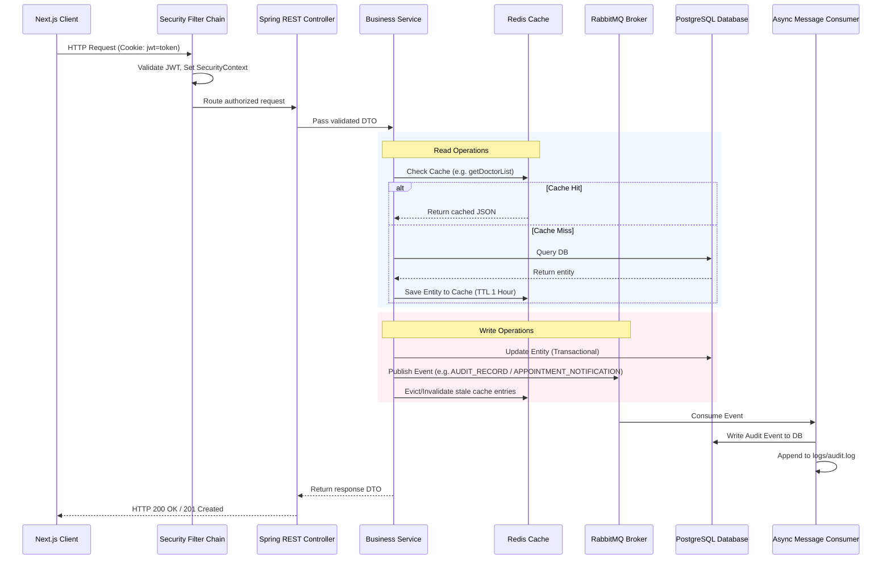
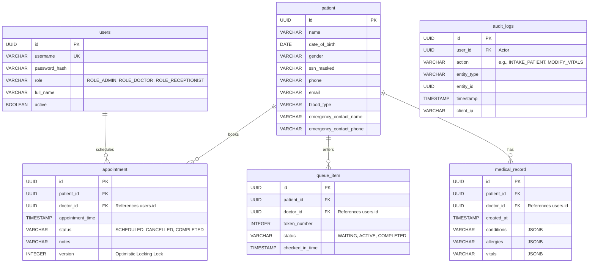

# System Architecture & Design Specification: Patient Management System (PMS) Backend

This document outlines the architectural patterns, database schemas, security configurations, and messaging workflows for the Spring Boot backend of the TokyoClinic OS Patient Management System.

---

## 1. Executive Summary

### Purpose
To transition the TokyoClinic OS Next.js frontend from simulated UI states to a secure, database-backed, high-performance production-ready system of record.

### Target Audience
Internal clinic staff categorized into three specific roles:
*   **Admins:** Manage system settings, staff credentials, and view system diagnostic logs/audit trails.
*   **Doctors:** View patient files, execute consultations, capture vitals, and process queue items.
*   **Receptionists/Nurses:** Perform patient intake registration, book appointments, and issue queue tokens.

---

## 2. Architectural Design

The backend is designed as a **Monolithic Clean Architecture** with functional packaging boundaries. This optimizes compile-time safety, maintains loose coupling, and allows seamless transition to microservices if needed.

### Package & Directory Structure

```
dev.salman.backend/
├── config/              # Global Configurations (Redis, RabbitMQ, Web, JPA)
├── security/            # Spring Security Configuration
│   ├── jwt/             # Stateless JWT filter chain, utility classes, cookie parser
│   └── service/         # Custom UserDetailsService & UserDetails implementation
├── audit/               # Database-backed Audit logging listeners and tables
├── messaging/           # RabbitMQ consumers, producers, and exchange configurations
├── features/            # Feature-focused modules containing Controllers, Services, Repositories, Entities, and DTOs
│   ├── auth/            # Staff Login & Registration APIs
│   ├── patient/         # Patient intake, search indices, and demographic records
│   ├── doctor/          # Doctor directories and schedule lookups
│   ├── appointment/     # Appointment scheduler (v1 API endpoints)
│   └── queue/           # Live clinic queue tokens & vital tracking
└── shared/              # Global models, global exceptions, and utilities
```

### Data Flow Diagram



---

## 3. Database Schema

We use **PostgreSQL** for strict transactional integrity, using dynamic **JSONB** data structures for clinical data to remain flexible without database schema bloat.

### Entity Relationship Diagram



---

## 4. Security & Authentication Design

### Stateless Session Security
Authentication is handled strictly using JSON Web Tokens (JWT) secured using client cookies.
1.  **Transport:** The client receives a JWT cookie upon successful login via `/api/auth/login`.
    *   `Set-Cookie: token=<jwt>; HttpOnly; Secure; SameSite=Strict; Path=/; Max-Age=86400`
2.  **Filter Interceptor:** The backend inspects the token on every incoming request using a custom filter extending `OncePerRequestFilter`. If validated, the user details are injected into `SecurityContextHolder`.
3.  **Role Verification:** Method security is enabled via `@EnableMethodSecurity`. Endpoints are annotated with `@PreAuthorize("hasRole('ADMIN')")`, `@PreAuthorize("hasAnyRole('DOCTOR', 'ADMIN')")`, etc.

---

## 5. Messaging & Asynchronous Processing (RabbitMQ)

To prevent web thread blocking and isolate non-critical services (like alert notifications or log archiving), we utilize **RabbitMQ** to handle asynchronous tasks.

### Queue Configuration
*   **Exchange:** `pms.direct.exchange`
*   **Routing Keys & Queues:**
    *   `routing.audit` -> `queue.audit-logging` (Handles database audit log writes and file exports)
    *   `routing.notifications` -> `queue.notifications` (Handles outbound SMS/email alert dispatches)

### Event Publisher Pattern
When a receptionist executes a patient intake form, the service:
1.  Saves the patient data to the database.
2.  Publishes an event message to RabbitMQ:
    ```json
    {
      "eventType": "PATIENT_INTAKE",
      "actorId": "c0a80101-38fd-11ed-a1eb-0242ac120002",
      "entityId": "a5b3c2d1-e89b-12d3-a456-426614174000",
      "timestamp": "2026-06-14T18:29:00Z",
      "clientIp": "192.168.1.10"
    }
    ```
3.  Returns `HTTP 201 Created` immediately to the client. The consumer picks up the message asynchronously to record the audit log.

---

## 6. Caching & Caching Eviction Strategy (Redis)

Redis is integrated as a high-frequency cache layer.
*   **Cache-Aside Pattern:** High-read queries (such as listing available doctors or checking today's appointment queue) query Redis. If a cache miss occurs, the backend reads PostgreSQL, writes back to Redis, and returns the data.
*   **Invalidation / Eviction:** Caches are evicted whenever data modifications occur.
    *   *Writing a consultation* evicts the cached queue item (`@CacheEvict(value = "queue", key = "#patientId")`).
    *   *Adding a doctor* evicts the entire doctor directory cache (`@CacheEvict(value = "doctors", allEntries = true)`).

---

## 7. Logging & Diagnostics

Logs are partitioned and saved in a dedicated `logs/` folder at the project root directory.

### Logback Appenders Configuration
1.  **Diagnostic Logger:** Outputs standard application diagnostics (`logs/app-info.log` and `logs/app-error.log`).
2.  **Audit File Appender:** The RabbitMQ consumer records JSON-formatted transaction logs directly to `logs/audit.log` (which rolls weekly or when reaching 10MB).

---

## 8. Decision Log

| ID | Decision | Alternatives Considered | Rationale |
| :--- | :--- | :--- | :--- |
| **DEC-01** | Monolithic Clean Architecture | CQRS/Event Sourced microservices | Lower operational complexity, faster startup, matches scale constraints (<100 appointments/day) while keeping domain separation high. |
| **DEC-02** | Stateless Cookie-Based JWT | Session-based JSESSIONID, header JWT | HttpOnly cookies mitigate XSS vulnerability without requiring stateful session clustering in multi-replica deployments. |
| **DEC-03** | RabbitMQ Async Events | Spring `ApplicationEventPublisher` | RabbitMQ provides message persistence (durability) and keeps HTTP threads completely isolated from database writes/external notifications. |
| **DEC-04** | Redis Caching Layer | JVM In-memory cache (Caffeine) | Using Redis ensures cache consistency when multiple replicas of the backend monolithic container run simultaneously. |
| **DEC-05** | logs/ Directory Placement | System `/var/log`, stdout-only | Local file rolling under a dedicated root directory ensures container diagnostics remain isolated, simple to extract, and predictable. |

---

## 9. Testing & Quality Assurance

*   **MockMvc Tests:** Security configs are validated by mock routing endpoints matching role restrictions (e.g., receptionists trying to hit doctor vitals APIs should yield `403 Forbidden`).
*   **Testcontainers Integration:** Integration tests run local database/broker configurations using Docker containers (`PostgreSQL` and `RabbitMQ`) at test time to avoid in-memory database configuration mismatches.
